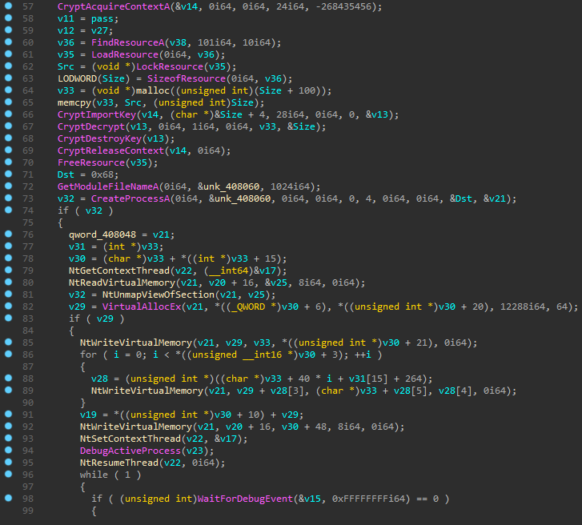
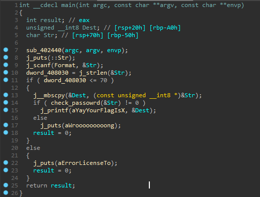
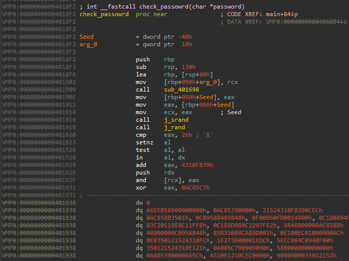
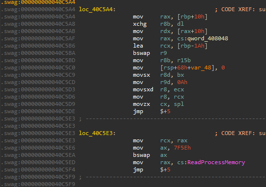
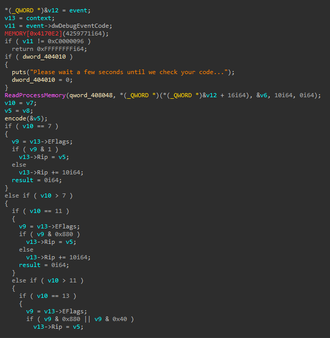

### Don't Jump


The last and the hardest challenge in reverse engineering. I solved it first and only 4 teams solved it after.

This task features self debugging and **nanomites** techniques.

WinMain:



The program creates new process in suspended state, loads and decrypts another executable from resources and injects it into the new process.

After that, **DebugActiveProcess** called and the child process resumes its execution.

First of all lets dump the child process.

Before WinMain the Tls_callback function checks debugger presence by calling **NtQueryInformationProcess** with **DebugPort** parameter. If it finds the presence of debugger, it changes the key that decrypts executable image so the data gets currupted.

The main function of child process:



And here comes the real challenge.

The check_password function is destoyed and when the child hits invalid instruction, the parent gets control back and checks what happend.



The parent's dispatch function is also destroyed, the first 20 bytes are stolen and the function is splitted with **jmp $+5** instructions. 



So first of all we have to recover dispatch function. I wrote IDApython script that nops every **jmp $+5** instruction. I also appended stolen bytes to the beggining of the function. After all that, the function started to make sence.




So what is going on here? Every time the child creates an exception this function gets called. If exception is  **STATUS_PRIVILEGED_INSTRUCTION**, 10 bytes from **rip** gets read.

```c++
typedef struct nanomite {
    BYTE nanomite;
    BYTE jmp_condition;
    QWORD encoded_address;
}
```

The first byte is an instruction that caused the exception, the second byte is the number between 0 and 14 that represents which conditional jmp to use in switch case statement.

The nanomite in this executable is **in al, dx**. It is a privileged instruction. Before nanomite is always some kind of check **cmp, test**. The dispatch function then checks eflag register and based on the flags sets **rip** + 10 or to encoded_address.

Now our goal is to remove every namonite from 2 functions.

I wrote an idapython script that removes nanomites and restores conditional jmps back.

After that everything can be decompiled :)

Here is the algorithm that is used.

``` c++
unsigned __int8 __fastcall check_pass(char *a1)
{
  unsigned int v1; // eax
  unsigned int v2; // eax
  unsigned int v3; // eax
  unsigned int v4; // eax
  int i2; // [rsp+48h] [rbp-38h]
  unsigned __int8 v7; // [rsp+4Fh] [rbp-31h]
  int k; // [rsp+E8h] [rbp+68h]
  unsigned __int8 v9; // [rsp+EFh] [rbp+6Fh]
  int Seed; // [rsp+F0h] [rbp+70h]
  int i4; // [rsp+F4h] [rbp+74h]
  int i3; // [rsp+F8h] [rbp+78h]
  int i1; // [rsp+FCh] [rbp+7Ch]
  int nn; // [rsp+100h] [rbp+80h]
  int mm; // [rsp+104h] [rbp+84h]
  int ll; // [rsp+108h] [rbp+88h]
  int kk; // [rsp+10Ch] [rbp+8Ch]
  unsigned int v18; // [rsp+110h] [rbp+90h]
  int jj; // [rsp+114h] [rbp+94h]
  int ii; // [rsp+118h] [rbp+98h]
  int n; // [rsp+11Ch] [rbp+9Ch]
  int m; // [rsp+120h] [rbp+A0h]
  int l; // [rsp+124h] [rbp+A4h]
  int j; // [rsp+128h] [rbp+A8h]
  int i; // [rsp+12Ch] [rbp+ACh]
  unsigned __int8 *password; // [rsp+140h] [rbp+C0h]

  password = (unsigned __int8 *)a1;
  Seed = gen_seed();
  j_srand(Seed);
  if ( j_rand() != 38 )                         // 1
  {
    for ( i = 0; i < password_len; ++i )
    {
      v1 = (unsigned int)((password[i] + 69) >> 31) >> 25;
      password[i] = ((v1 + password[i] + 69) & 0x7F) - v1;
    }
  }
  if ( j_rand() == 0x1E27 )                     // 2 yes
  {
    for ( j = 0; j < password_len; ++j )
    {
      v9 = password[j];
      for ( k = 0; k != 236; ++k )
        v9 = (v9 >> 7) | (2 * v9);
      password[j] = v9;
    }
  }
  if ( j_rand() > 0x4D21 )                      // 3 yes
  {
    for ( l = 0; l < password_len; ++l )
      password[l] = ~(password[l] & 0x4A) & (password[l] | 0x4A);
  }
  if ( j_rand() > 0x9F9 )                       // 4 
  {
    for ( m = 0; m < password_len; ++m )
    {
      v2 = (unsigned int)((password[m] + 7) >> 31) >> 25;
      password[m] = ((v2 + password[m] + 7) & 0x7F) - v2;
    }
  }
  if ( j_rand() <= 0x2297 )                     // 5 yes
  {
    for ( n = 0; n < password_len; ++n )
      password[n] = ~(password[n] & 0x1B) & (password[n] | 0x1B);
  }
  if ( j_rand() <= 0x2DF5 )                     // 6
  {
    for ( ii = 0; ii < password_len; ++ii )
      password[ii] = ~(password[ii] & 0x65) & (password[ii] | 0x65);
  }
  if ( j_rand() % 2 == 1 )                      // 7 yes
  {
    for ( jj = 0; jj < password_len; ++jj )
      password[jj] = ~(password[jj] & 0xB) & (password[jj] | 0xB);
  }
  v18 = gen_seed() ^ 0xDEADBEEF;                // deadbeef yes
  for ( kk = 0; kk < password_len; ++kk )
  {
    password[kk] -= v18;
    LOBYTE(v18) = password[kk];
  }
  if ( j_rand() >> 4 > 263 )                    // 8 yes
  {
    for ( ll = 0; ll < password_len; ++ll )
    {
      v3 = (unsigned int)((password[ll] - 7) >> 31) >> 25;
      password[ll] = ((v3 + password[ll] - 7) & 0x7F) - v3;
    }
  }
  if ( j_rand() == 0x28D2 )                     // 9 yes
  {
    for ( mm = 0; mm < password_len; ++mm )
      password[mm] = ~(password[mm] & 0x5F) & (password[mm] | 0x5F);
  }
  if ( j_rand() != 0 )                          // 10 yes
  {
    for ( nn = 0; nn < password_len; ++nn )
      password[nn] = ~(password[nn] & 0x54) & (password[nn] | 0x54);
  }
  if ( j_rand() != 0x10F2C )                    // 11 yes
  {
    for ( i1 = 0; i1 < password_len; ++i1 )
    {
      v7 = password[i1];
      for ( i2 = 0; i2 != 37; ++i2 )
        v7 = (v7 << 7) | ((int)v7 >> 1);
      password[i1] = v7;
    }
  }
  if ( j_rand() != 0x6DC4 )                     // 12 
  {
    for ( i3 = 0; i3 < password_len; ++i3 )
    {
      v4 = (unsigned int)((password[i3] + 7) >> 31) >> 25;
      password[i3] = ((v4 + password[i3] + 7) & 0x7F) - v4;
    }
  }
  for ( i4 = 0; i4 < password_len; ++i4 )
  {
    if ( (~(unsigned __int8)(qword_404020[i4] & password[i4]) & (qword_404020[i4] | password[i4])) != 0 )
      return 0;
  }
  return 1;
}
```

The gen_seed is also can be decompiled now:

``` c++
int __stdcall gen_seed()
{
  unsigned __int64 k; // [rsp+30h] [rbp-30h]
  unsigned __int64 x_4; // [rsp+38h] [rbp-28h]
  unsigned __int64 x_3; // [rsp+40h] [rbp-20h]
  int j; // [rsp+48h] [rbp-18h]
  int i; // [rsp+4Ch] [rbp-14h]
  unsigned __int64 x_2; // [rsp+50h] [rbp-10h]
  unsigned __int64 x_1; // [rsp+58h] [rbp-8h]

  x_1 = 1i64;
  x_2 = 1i64;
  for ( i = 1; i <= 42068; ++i )
    x_1 = x_1 * i % 0x133D215;
  for ( j = 66012; j > 23944; --j )
    x_2 = x_2 * j % 0x133D215;
  x_3 = 1i64;
  x_4 = x_1;
  for ( k = 1i64; k <= 0x133D213; k *= 2i64 )
  {
    if ( k & 0x133D213 )
      x_3 = x_4 * x_3 % 0x133D215;
    x_4 = x_4 * x_4 % 0x133D215;
  }
  return ~((x_2 * x_3 % 0x133D215) & 0x1298E1A) & ((x_2 * x_3 % 0x133D215) | 0x1298E1A);
}
```

So, **gen_seed** always return 0, and since it passed to **srand** every **rand** after that returns known sequence.

And because of that, there is no random and we can mark every loop that is being executed. (i marked it as "yes")

The solution is simple. We bruteforce every printable character and check if it meets the conditions.

Solution:

```c++
#include <stdint.h>
#include <iostream>

unsigned char key[] = {
0xEA, 0x9A, 0x12, 0x73, 0x91, 0xEA, 0x02, 0xF3,
0x0B, 0x69, 0x9A, 0xE8, 0x13, 0xF1, 0x13, 0xF0,
0x8A, 0xE3, 0x9B, 0x68, 0x92, 0x71, 0x10, 0x68,
0x80, 0xFA, 0x09, 0x73, 0x88, 0xF2, 0x92, 0x1A,
0x40
};
int deadbeef = 0xdeadbeef;
int new_deadbeef = 0;

int main() {
	unsigned char password[sizeof(key)] = { 0 };
	for (int i = 0; i < sizeof(key); i++) {
		for (int ch = 0; ch < 255; ch++) {
			password[i] = ch;
			// 2
			if (ch == 'i' && i == 0)		// i or a
				continue;
			unsigned char t = password[i];
			for (int k = 0; k != 236; ++k)
				t = (t >> 7) | (2 * t);
			password[i] = t;
			// 3
			password[i] = ~(password[i] & 0x4A) & (password[i] | 0x4A);
			// 5
			password[i] = ~(password[i] & 0x1B) & (password[i] | 0x1B);
			// 7
			password[i] = ~(password[i] & 0xB) & (password[i] | 0xB);
			// deadbeef
			password[i] -= deadbeef;
			new_deadbeef = password[i];
			// 8
			password[i] = (password[i] - 7) % 128;
			// 9
			password[i] = ~(password[i] & 0x5F) & (password[i] | 0x5F);
			// 10
			password[i] = ~(password[i] & 0x54) & (password[i] | 0x54);
			// 11
			unsigned char v7 = password[i];
			for (int i2 = 0; i2 != 37; ++i2)
				v7 = (v7 << 7) | ((int)v7 >> 1);
			password[i] = v7;
			// check
			if ((key[i] == password[i])) {
				int y = password[i];
				char x = ch;
				std::cout << x;
				deadbeef = new_deadbeef;
				break;
			}
			if (ch == 0xfe) {
				std::cout << i << " no letter :( " << std::endl;
				return 0;
			}
		}
	}
}
```

The key is:

```
afWfgtWAsDebuggerPreseftWreturfW0
```

After submitting it to the server we get an actual flag.

Thanks for reading :)

And thanks to **Vlad171** for the fun challenges.
